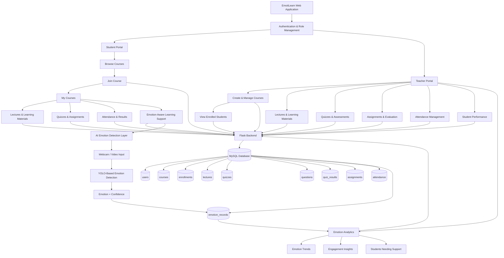

# EmotiLearn – AI-Powered Emotion-Aware Learning Platform

EmotiLearn is a learning management platform that connects **students and teachers** in one system. It supports course management, student enrollment, lectures and learning materials, quizzes, assignments, attendance, academic performance, and an AI-based emotion-aware learning layer.

## Architecture Flow



## High-Level Data Flow

```text
User
  ↓
Role-Based Login
  ↓
Student / Teacher Portal
  ↓
Flask Backend
  ↓
MySQL Database
  ↓
Learning Activity
  ↓
AI Emotion Detection
  ↓
Emotion Records
  ↓
Student Support + Teacher Analytics
```

## Core Modules

### Student Portal

- Student registration and login
- Browse available courses
- Join courses
- View enrolled courses
- Access lectures and learning materials
- Attempt quizzes and assessments
- Submit assignments
- View attendance and academic results
- Emotion-aware learning support

### Teacher Portal

- Teacher registration and login
- Create and manage courses
- View enrolled students
- Add lectures and learning materials
- Add video and notes/PDF links
- Create and conduct quizzes
- Manage assignments and evaluation
- Manage attendance
- Monitor student performance
- Emotion analytics for learning engagement and student support

## Current Learning Flow

```text
Teacher creates course
        ↓
Student browses available courses
        ↓
Student joins course
        ↓
Enrollment is stored in MySQL
        ↓
Course appears in student's dashboard
        ↓
Student appears in teacher's enrolled-students list
        ↓
Teacher manages lectures and learning materials
        ↓
Student accesses course learning materials
```

## Emotion-Aware Learning Flow

```text
Student Learning Session
        ↓
Webcam / Video Input
        ↓
YOLO-Based Emotion Detection
        ↓
Detected Emotion + Confidence
        ↓
Emotion Record
        ↓
Learning Engagement Analysis
        ↓
Teacher Emotion Analytics
        ↓
Personalized Student Support
```

## Technology Stack

- **Frontend:** HTML, CSS, JavaScript
- **Backend:** Python, Flask
- **Database:** MySQL / MySQL Workbench
- **AI:** YOLO-based facial emotion detection
- **Authentication:** Role-based Student and Teacher authentication

## Project Structure

```text
EmotiLearn-AI-Cloud-Learning-Platform/
│
├── backend/
│   ├── app.py
│   ├── auth.py
│   ├── database.py
│   └── requirements.txt
│
├── frontend/
│   ├── static/
│   │   └── css/
│   │       ├── style.css
│   │       └── portal.css
│   │
│   └── templates/
│       ├── index.html
│       ├── login.html
│       ├── signup.html
│       ├── student_dashboard.html
│       ├── teacher_dashboard.html
│       └── teacher_lectures.html
│
└── README.md
```

## Local Setup

### 1. Clone the repository

```bash
git clone https://github.com/NamburiRupesh/EmotiLearn-AI-Cloud-Learning-Platform.git
cd EmotiLearn-AI-Cloud-Learning-Platform
```

### 2. Create and activate the virtual environment

```powershell
python -m venv emotilearn_env
emotilearn_env\Scripts\activate
```

### 3. Install dependencies

```powershell
pip install -r backend\requirements.txt
```

### 4. Configure MySQL

Create the database in MySQL Workbench:

```sql
CREATE DATABASE emotilearn_db;
USE emotilearn_db;
```

Create the project's required tables before running the application.

The application currently uses a local MySQL database through `backend/database.py`.

### 5. Run the application

```powershell
python backend\app.py
```

Open:

```text
http://127.0.0.1:5000
```

## Current Development Status

### Completed

- Student and Teacher role selection
- Role-specific login
- Student dashboard
- Teacher dashboard
- Teacher course creation
- Student course browsing
- Student course enrollment
- Teacher enrolled-student list
- Teacher lecture and learning-material management
- Emotion-aware learning sections in Student and Teacher portals

### Next Modules

- Quiz creation and question management
- Student quiz attempts and results
- Assignment creation and submission
- Attendance management
- Student performance analytics
- Full YOLO emotion detection integration
- Teacher emotion analytics dashboard
- Online class integration
