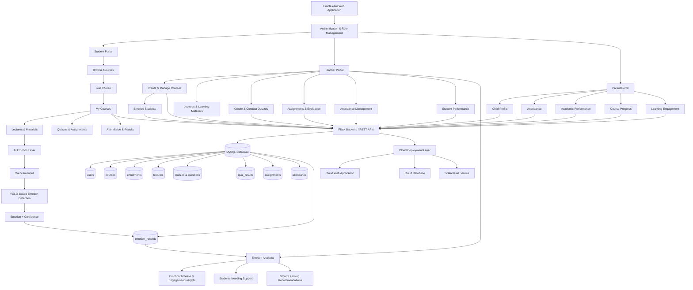

# EmotiLearn – AI-Powered Emotion-Aware Cloud Learning Platform

EmotiLearn is a cloud-ready learning management platform that connects **students, teachers, and parents** in one system. The platform manages courses, enrollments, lectures, quizzes, assignments, attendance, academic performance, and an AI-based emotion-aware learning layer.

## Architecture Flow



## High-Level Data Flow

```text
User
  ↓
Role-Based Login
  ↓
Student / Teacher / Parent Portal
  ↓
Flask Backend
  ↓
MySQL Database
  ↓
Academic Data & Learning Activity
  ↓
AI Emotion Layer
  ↓
Emotion Records + Learning Insights
  ↓
Personalized Student Support / Teacher Analytics
```

## Core Modules

- Role-based authentication for Student, Teacher, and Parent
- Teacher course creation and management
- Student course browsing and enrollment
- Teacher enrolled-student management
- Lectures and learning materials
- Quizzes and assessments
- Assignments and evaluation
- Attendance management
- Academic performance tracking
- Emotion-aware learning support
- Cloud-ready architecture

## Technology Stack

- **Frontend:** HTML, CSS, JavaScript
- **Backend:** Python, Flask
- **Database:** MySQL
- **AI:** YOLO-based facial emotion detection
- **Deployment:** Cloud-ready web application architecture

## Current Learning Flow

```text
Teacher creates course
        ↓
Student browses available courses
        ↓
Student joins course
        ↓
Enrollment is stored in MySQL
        ↓
Course appears in student's dashboard
        ↓
Student appears in teacher's enrolled-students list
```
